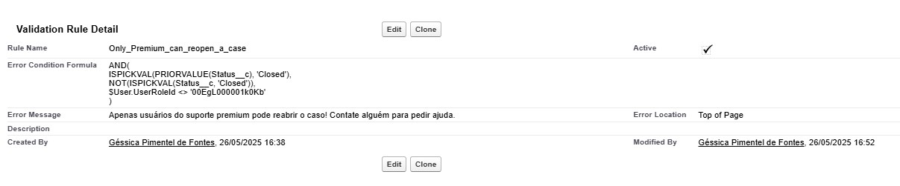
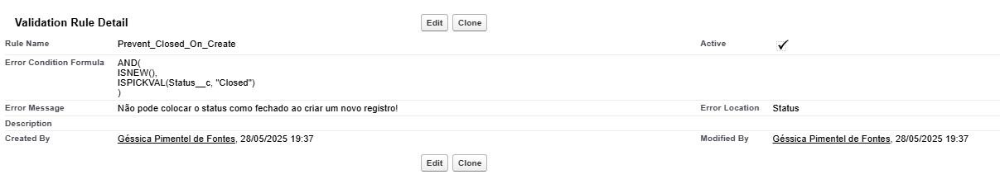
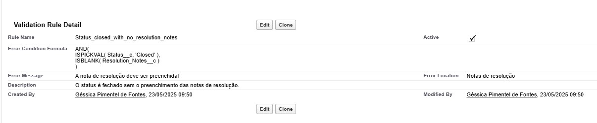
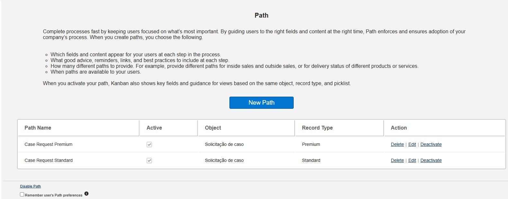
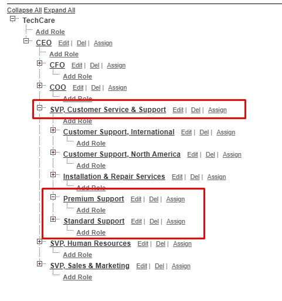
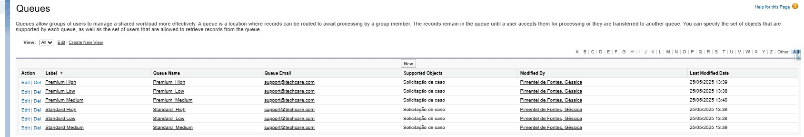

# Apps & tabs
**Explicação**: Foi criado um app chamado `TechCare Support` que contém as tabs `Solicitaçã de casos`, `Relatórios` e `Gráficos`.

**Teste**:
| Passos    | Ação      | Exemplo|
|-----------|-----------|-------|
|1. Pré-requisitos:| É necessário ter um user de administrador, ou já está atribuído a um dos permissionamentos, `Support Standard`ou `Support Premium`.| |
|2.| Clique no `App Launcher`| 
|3.| Selecione `TechCare Support`| |

# Objetos Customizados
## Objeto Case_Request__c 
**Explicação**: O objeto em questão é onde amarzenamos os nossos casos.

### Campos
| Label | Name| Data Type |
|-------|-----|----------|
|Asssunto|Subject_c|Text(255)|
|Caso ID| Name| Auto Number|
|Conta|Account__c|Lookup(Account)|
|Contato|Contact__c|Lookup(Contact)|
|Contato Emergencial|Emergency_Contact__c|Text(80)|
|Created By|CreatedById|Lookup(User)|
|Data e hora de fechamanento| ClosedDataTime__c|Date/Time|
|Descrição|Description__c|Long Text Area(32768)|
|Email Web|Email_Web__c|Email|
|Empresa Web|WebCompany__c|Text(80)|
|Evidências|Evidence__c|Long Text Area(32768)|
|Impacto|Impact__c|Picklist|
|Last Modified By|LastModifiedById|Lookup(User)|
|Nome Web|WebName__c|Text(80)|
|Notas de resolução|Resolution_Notes__c|Long Text Area(32768)|
|Origem do caso|CaseOrigin__c|Picklist|
|Owner|OwnerId|Lookup(User, Group)|
|Prazo SLA| SLA_Deadline__c | Date/Time|
|Prioridade|Priority__c|Picklist|
|Produto|Product__c|Picklist|
|Razão do caso|Case_Reason__c|Picklist|
|Record Type|RecordTypeId|Record Type|
|Sistema de terceiros envolvido|ThirdPartySystemInvolved__c|Text(80)|
|Status|Status__c|Picklist|
|Telefone Web|WebPhone__c|Text(40)|
|Tempo de resolução|Resolution_Time__c|Time|
|Tempo de resolução em número|Time_resolution_numebr__c|Formula(Number)|
|Tipo|Type__c|Picklist|
|Urgência|Urgency__c|Picklist|

**Resultado**: 

### Record Type e Page Layouts
**Explicação**: Temos dois record types, onde a diferença em si no layout é a obrigatoriedade em preencher a descrição. Já que normalmente apenas o assunto é necessário para compreender um caso.

#### Record Types

#### Page Layouts

### Validation Rules
**Explicação**: Temos regras de valições que seguem algumas regras de negócio.

#### Only_Premium_can_reopen_a_case	
**Explicação**: Apenas usuários do suporte premium podem reabrir o caso.

#### Prevent_Closed_On_Create
**Explicação**: Não pode colocar o status como fechado ao criar um novo registro.

#### Status_closed_with_no_resolution_notes	
**Explicação**: A nota de resolução deve ser preenchida antes de o status ser closed.

### Path
**Explicação**: Foi criado um path para um facilidade visual maior do caminho para o suport.

**Resultado**: 

**Teste**:
| Passos    | Ação      | Exemplo|
|-----------|-----------|-------|
|1. Pré-requisitos:| É necessário ter um user de administrador, ou já está atribuído a um dos permissionamentos, `Support Standard`ou `Support Premium`.| |
|2.| Clique no `App Launcher`| 
|3.| Selecione `TechCare Support`| |
|4.| Clique no botão `new`ou `novo` |  |
|5.| Escolha um tipo de record type (Premium ou Standard)|  |
|6.| Preencha todos os campos obrigatórios e crie o registro|  |
|7.| Mude o status para `Closed`| |

## Objeto Case_History__c
**Explicação**: O objeto em questão armazena os casos e se o SLA dos mesmo foram cumpridos ou não.

### Campos
| Label | Name| Data Type |
|-------|-----|----------|
|Caso|Case__c|Lookup(Solicitação de caso)|
|Created By|CreatedById|Lookup(User)|
|Last Modified By|LastModifiedById|Lookup(User)|
|Nome|Name|Auto Number|
|Owner|OwnerId|Lookup(User, Group)|
|SLA Atendido|SLA_Met__c|Checkbox|
|Tempo de fechamento|Time_Closed__c|Time|

# Permissions sets e Roles
## Roles
**Explicação**: Dois Roles foram criados dentro de SVP, Customer Service & Support, `Premium Support` e `Standard Support`, para ajudar na atribuição, como o role é algo atribuído na criação do usuário, se tem um controle maior de quem pode usar aquilo ou não. 

## Public Groups
**Explicação**: Existem dois grupos públicos `Premium Support` e `Standard Support`, ambos foram criados para uma maior facilidade ao compartilhamento de conteúdo como relatórios e gráficos. E ambos tem roles designadas, também visando uma maior facilidade na hora de atribuição de conteúdos.

## Permission Sets
**Objetivo**: Garantir acesso e layout diferentes dependendo do permission set aplicado.

### Support Standard
#### Objeto Case_Request__c

**Explicação**: O objeto é visível, tendo permissão até de deletar o registro do mesmo e também é permitido a criação dos dois tipos de registro (Premium e Standard).
Quase todos os campos estão liberados para visualizar ou editar, menos o SLA_Deadline__c e Time_resolution_number__c.

### Support Premium
#### Objeto Case_Request__c

**Explicação**: O objeto é visível, tendo permissão até de deletar o registro do mesmo e também é permitido a criação dos dois tipos de registro (Premium e Standard).
Quase todos os campos estão liberados para visualizar ou editar, menos o Time_resolution_number__c.

### Support Standard e Support Premium
#### Objeto Case_History__c

**Explicação**: O objeto em sí é apenas visível, isso por conta da automação de criação que ocorre sempre que o status do caso é `Closed`.

**Teste**:
| Passos    | Ação      | Exemplo|
|-----------|-----------|-------|
|1. Pré-requisitos:| É necessário ter um user de administrador (para se atribuir a uns dos permissions) ou já está atribuído ao permissionamento.| |
|2.| Clique no `App Launcher`| 
|3.| Selecione `View All` ou `Ver todos`| 
|4.| Na barra de pesquisa, escreva `Solicitação de casos` e clique na mesma.|  |
|5.| Clique no botão `new`ou `novo` |  |
|6.| Escolha um tipo de record type (Premium ou Standard)|  |

# Page layout dinamics
**Explicação**: Foi criado uma lightning page no app builder para tanto a parte de UX quanto para suprir algumas demandas.

Grande parte da obrigariedade foi deixada na responsibilidade da lightning page, por se tratar de dois record pages, ela cobre os dois.

Foram colocados filtros para visualização de determinadas seções.

## Informações Críticas
**Explicação**: Essa seção só irá aparecer quando a prioridade do registro for alto, demonstrando uma mair importância nos detalhes para a solução do caso.

## Seção Web
**Explicação**: Nesse caso, essa seção só irá aparecer quando a forma de contato for web, demandando informações especiais para o tipo de contato específico.

# Relatório e Dashboard
**Explicação**: Foram criados 3 relátorios a espera de atender a demanda, onde os 3 foram colocados em uma pasta `Case Request` pública com acesso dispoível para os grupos públicos `Premium Support` e `Standard Support`.

## Relatórios

### Cases opened by priority and status
**Explicação**: Casos abertos em uma tabela, baseados em prioridade e status.

### Open vs. closed cases in the last 7 days
**Explicação**: Casos abertos e fechados na última semana. 

### Resolution case per type
**Explicação**: Casos resolvidos com bate no tipo e a média de hora de cada que levou para resolver.

## Gráficos

### Gráfico de Solicitação de Caso
**Explicação**: Aqui temos dois gráficos, um do report de casos abertos e fechados nos últimos 7 dias e o de tempo médio fechamento de tipo de caso.

# Flows
## Assigning SLA Date and Time
**Explicação**: Esse flow irá preencher o campo de SLA após a criação de um caso, determinando pelo tipo de registro que foi selecionado. Se for premium, é SLA de 8 horas, caso seja Standard, o SLA será de 24 horas.

## Case Request Escalation
**Explicação**: Esse flow schedule irá rodar diariamente as 00:00 e irá verificar se um caso passou do seu SLA determinado e caso isso seja verdadeiro, ele irá mudar o status para `Escalado`.

## Change Request Case Closed Date/Time
**Explicação**: Esse flow irá ser acionado quando o caso muda para o status `Fechado`, inserindo a data e hora atual ao campo `Data e hora de fechamento`.

## Request Case Queue Attribution
**Explicação**: Esse é um flow autolaunched onde é necessário a inserção de um botão na página de registro para chamar o mesmo.

### Queues
**Explicação**: Foram criadas 6 filas com base no nível de severidade de um caso e também tipo de registro.

### Flow
**Explicação**: O flow determina qual o tipo de record e também sua severidade, enviando para a fila designada.

### Botão
**Explicação**: Foi criado um botão no objeto que se referencia ao flow, onde que toda vez que for clicado, ocorrerá a atribuição de fila para registro.

| Passos    | Ação      | Exemplo|
|-----------|-----------|-------|
|1. Pré-requisitos:| É necessário ter um user de administrador, ou já está atribuído a um dos permissionamentos, `Support Standard`ou `Support Premium`.| |
|2.| Clique no `App Launcher`| 
|3.| Selecione `TechCare Support`| |
|4.| Clique no botão `new`ou `novo` |  |
|5.| Escolha um tipo de record type (Premium ou Standard)|  |
|6.| Preencha todos os campos obrigatórios e crie o registro|  |
|7.| Clique no botão de atribuição de fila. ||
