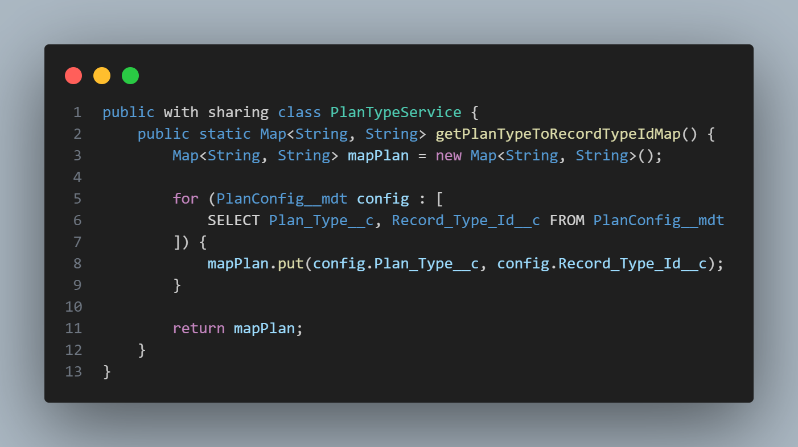

# Trigger
**Explicação**: O Trigger criado foi para o objeto personalizado, o case_resquest__c. Esse trigger será acionado após o update, onde ele chama o handler `CaseRequestTriggerHandler`.

# Handler
**Explicação**: Foi usado um framework handler aconselhado a ser usado para auxiliar, o sfdc trigger framework.

## CaseRequestTriggerHandler
**Explicação**: Ele é filho do TriggerHandler, onde métodos virtuais do pai como o afterUpdate, entre outros, é possível fazer a sobrescrição (override). Nesse caso ele irá fazer um loop para os registro que acionaram o trigger `after update` e irá validar se o status atual é `Closed`, evitando pegar registros que já estavam `Closed` e foram atualizados.
No final, temos uma validação que verifica se a lista está ocupada e caso esteja, estará chamando as classes auxiliares.

# Utility
**Explicação**: Foram criadas algumas classes auxiliares, entre elas, as utilities.

## CaseHistoryUtility
**Explicação**: Essa é a classe auxiliar que estará criando o `Case_History__c` e relacionando com o registro do `Case_Request__c`.

## CaseRequestUtility
**Explicação**: Essa classe estará atualizando o campo `Resolution_time__c` caso o status do caso seja closed, essa automatização foi feita para ter um tipo de visualização `time`, sendo visualmente melhor para verificar o tempo que demorou para conclusão do caso.

## DateTimeUtility
**Explicação**: Aqui a gente tem essa classe para auxiliar na conversão de tipos Date/Time para outros tipos e pegar a diferença dos dois valores enviados. O primeiro método, `getTimeDifference` irá pegar retorna a diferença de um valor inicial e um final no tipo `Time`, enquanto que, o `getMinutesDifference` irá retorna essa diferença em minutos.

# Service
**Explicação**: Foi criada duas classes de serviço para ajudar na regra de negócio, sobre SLA e tipos de registro.

## SLAService
**Explicação**: Essa classe irá verificar com base no tipo de registro, sendo `PREMIUM` ou `STANDARD`, como também a hora que o registro foi criado e fechado, retornando um boolean caso tenha atendido ou SLA ou não.

## PlanTypeService
**Explicação**: O `PlanTypeService` é uma classe que puxa os dados dos tipos de registros possíveis, `Premium` e `Standard` e devolve o id dos mesmos.

### Custom Metadata Types
**Explicação**: O `Custom Metada Type` foi criado buscando uma maior facilidade na leitura do código e também para não deixar os dados a deriva.

# LWC - CaseRequestCountDown
**Explicação**: É um componente que vai fazendo a contagem regressiva do SLA do registro.

# Rest Resource - CaseRequestRestResource
## GET ***/CaseRequest/{Id}***
**Explicação**: Esse get com o id do registro do Case_Request__c irá retorna o Id, status e slaMet.

# Test

## TestDataFactory
**Explicação**: É uma fábrica de dados para facilitar a criação dos registros com a reutilização e limpeza no código. Tem 3 métodos dentro dela, sendo criação de conta, criação de contato e solicitação de caso.

## CaseHistoryUtility_Test
**Explicação**: É o teste da criação de histórico de caso ao mudar o status do caso para closed.

## CaseRequestRestResource_Test
**Explicação**: É o teste do caminho get do rest, validando seu retorno.

